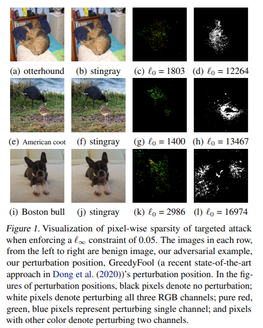
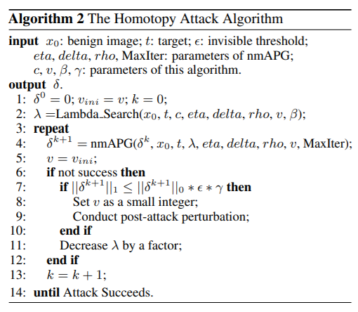

# Sparse and Imperceptible Adversarial Attack via a Homotopy Algorithm

[ICML 2021 Long Talk] [Sparse and Imperceptible Adversarial Attack via a Homotopy Algorithm.](https://arxiv.org/abs/2106.06027)

Mingkang Zhu, Tianlong Chen, Zhangyang Wang

## Overview

We proposed Homotopy Attack, a homotopy algorithm for sparse adversarial attack that aim to find sparse adversarial perturbations with relatively small magnitudes. The sparsity of the perturbation is regularized by the L_0 norm and the magnitude is constrained by the L_inf norm. The proposed algorithm can achieve much sparser results under the same L_inf constraint when compared to the SOTA.




## Prerequisites

```
pytorch

torchvision

scipy 1.2.1

pillow

Download the pretrained Inception-v3 model from https://download.pytorch.org/models/inception_v3_google-1a9a5a14.pth and put it into the pretrain folder
```

## Usage

```
python demo_attack.py --img_dir path/to/imgs
```

## Parameter Setting

```
--imgdir             path to input images
--target_class       target class
--dec_factor         decreasing factor for lambda per iteration
--val_c              constant multiplied with searched intial lambda
--val_w1             weight for post attack stage
--val_w2             weight for post attack stage
--val_gamma          threshold of triggering the post attack stage
--max_update         max L_0 update per outer iteration
--max_epsilon        L_inf constraint      
--maxiter            max inner iteration to run nmAPG per outer iteration of homotopy
```

Hint:

For lower `--max_epsilon`, `--val_c` should be lower and `--max_update` should be higher.

For higher `--max_epsilon`, `--val_c` should be higher and `--max_update` should be lower.

Please adjust the parameters accordingly so that the average perturbation per entry is close to the L_inf constraint `--max_epsilon`, which can lead to sparser results.

For detailed parameter setting, please refer to the Appendix.

## Citation

```
@misc{zhu2021sparse,
    title={Sparse and Imperceptible Adversarial Attack via a Homotopy Algorithm},
    author={Mingkang Zhu and Tianlong Chen and Zhangyang Wang},
    year={2021},
    eprint={2106.06027},
    archivePrefix={arXiv},
    primaryClass={cs.LG}
}
```
